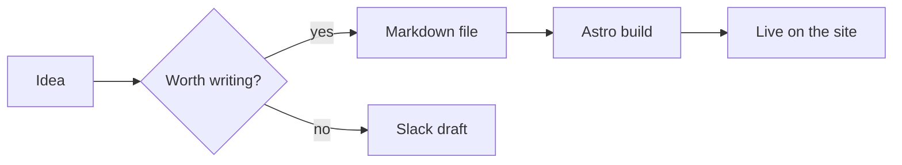

Hi — I'm Maanasa. This corner of the internet is new, and so is the habit
I'm trying to build: writing things down as I learn them.

For years my notes lived in private docs and Slack threads where they
slowly became unsearchable. The plan with this blog is simple:

- Write **short, specific** posts.
- Favour **lessons over hot takes**.
- Keep the bar at "useful to one other engineer" — including future me.

## Why Astro

I rebuilt the site on **Astro** because:

1. The landing page is mostly static, and Astro renders static HTML by default.
2. Markdown content collections are first-class — perfect for a blog.
3. Interactive bits (the navbar, the contact card with copy-to-clipboard) ship
   as React islands, hydrated only where needed.

The result: less JavaScript on the wire, faster pages, and a writing flow that
is literally _just write a markdown file_.

## What this blog supports

Beyond plain prose, posts here can include:

### Mermaid diagrams



### Math (KaTeX)

The classic identity from Euler, $e^{i\pi} + 1 = 0$, rendered inline.

And block math, like the Cauchy–Schwarz inequality:

$$
\left( \sum_{k=1}^n a_k b_k \right)^2 \le \left( \sum_{k=1}^n a_k^2 \right)
\left( \sum_{k=1}^n b_k^2 \right)
$$

### Code blocks (syntax highlighted via Shiki)

```ts
type Post = {
  title: string;
  pubDate: Date;
  tags: string[];
};

const isRecent = (p: Post) =>
  Date.now() - p.pubDate.valueOf() < 30 * 24 * 60 * 60 * 1000;
```

## What you'll find here

- Notes from **shipping at Kayak** — Java integrations, Kibana, A/B rollouts.
- **Joining Google** in June 2026: the AI Mode Feedback team in Search.
- Side projects, half-baked ideas, and the occasional postmortem.

Subscribe via [RSS](/rss.xml) or just bookmark this page. New post when there's
something worth saying — no schedule.
